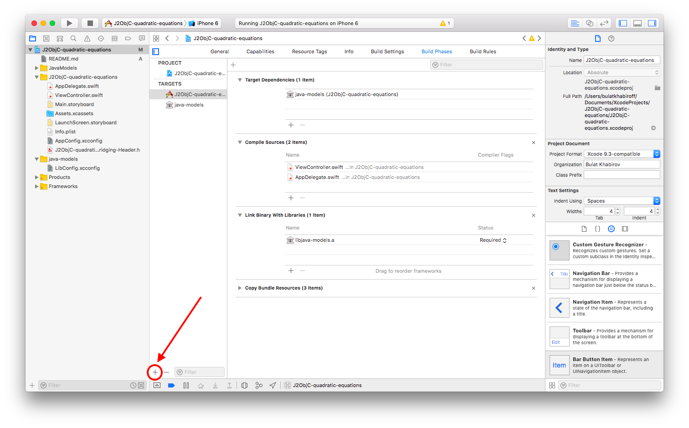
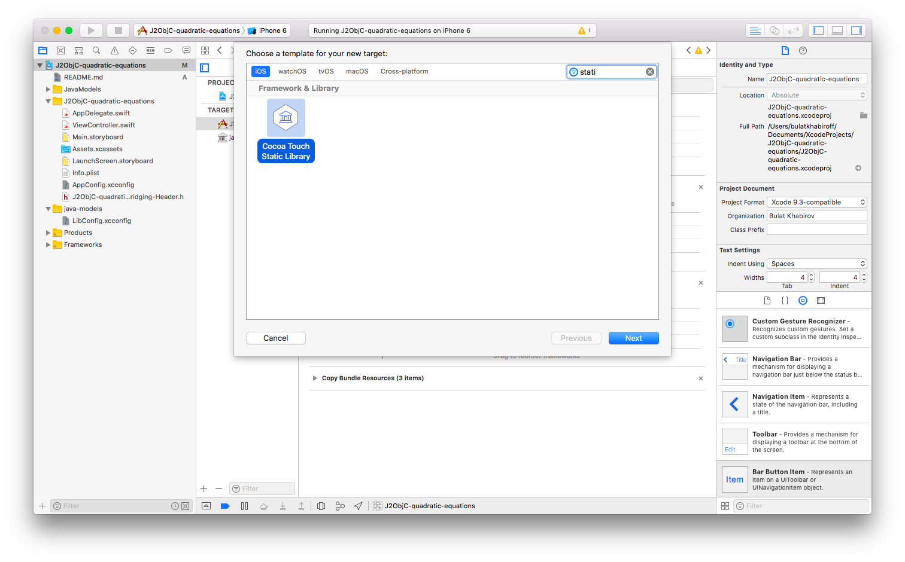
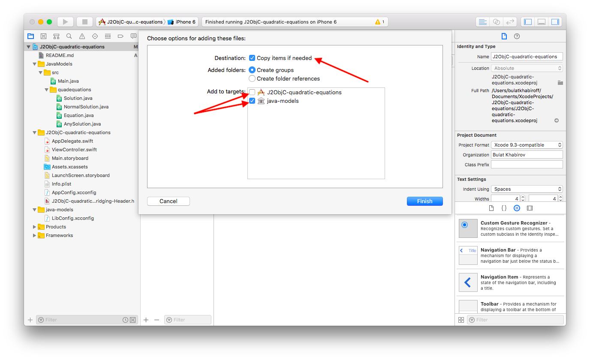
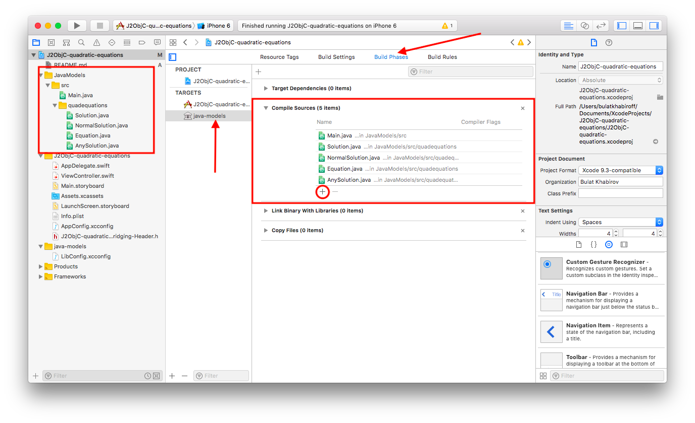
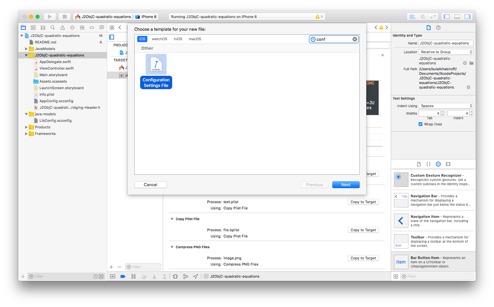
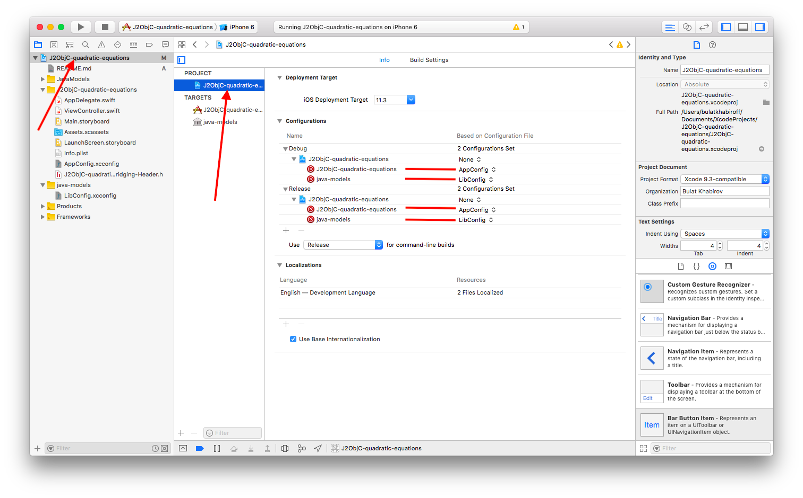
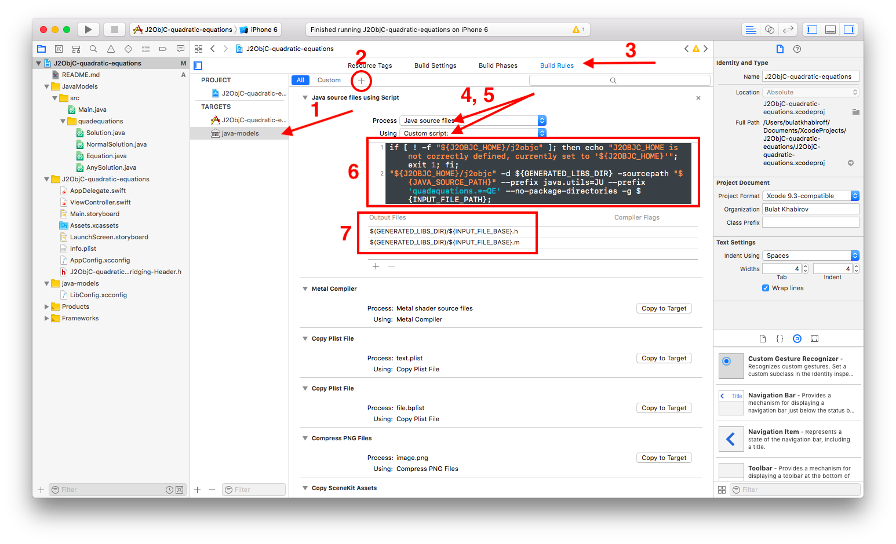
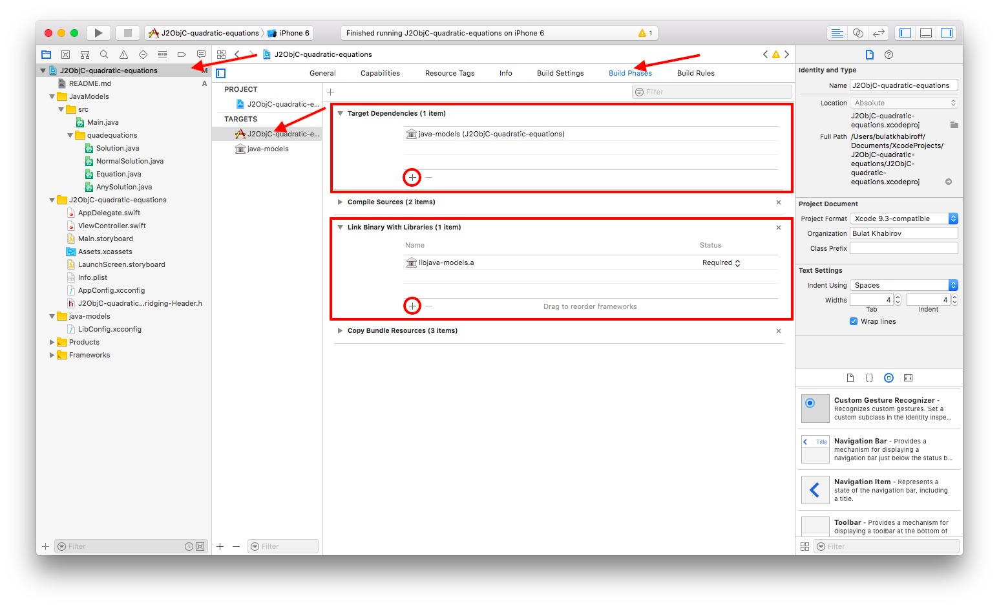

# Using J2ObjC with Xcode tutorial
This is an example of how J2ObjC can be used with Xcode projects, and a step by step tutorial for it. In a nutshell, it suggests adding Java files into a separate static library target of an existing Xcode project. This way it is possible to avoid Objective-C generated classes' naming problems, get better debugging tools and turn off ARC in a separate target.

# Assumtions
This tutorial assumes following conditions:
- You have latest Xcode installed (tested on Xcode 9)
- You have downloaded J2ObjC (tested on version 2.0.5). You can find a complete guide [here](https://developers.google.com/j2objc/guides/getting-started).
  - The example project assumes you have the J2ObjC folder stored at ~/j2objc-dist

# Tutorial
## Add a new static library target
The reason why we create a separate target for j2objc generated files, it allows us to extra build configuration to the target without affecting the main app target. One particular thing is that we want to turn off ARC for performance gains. With a separate target, we can turn off ARC on the static library target, but keep ARC on for the main app. Another case is that since J2ObjC's `--no-package-directories` flag puts all the output files from all transpiled Java packages into one folder, types from different packages but same names can overwrite files of each other (J2ObjC's output files have same names as input files, without package prefixes) and produce compiler errors. By creating separate targets with separate output files folders for conflicting packages, you can avoid that. 




## Adding Java source files to the project
Now you can add your Java sources to the newly creataed target(s). Before doing that, you can *optionally* add a Java project as a Git submodule as following:
```
cd path/to/your/xcodeproject
git submodule add example.com/url/to/your/java-repository.git
```
This is an optional step that allows you to develop your Java project separately and pull new updates to your iOS repo in a more convenient way.

You can add .java files to your project just as you would add Objective-C or Swift sources: by dragging selected sources into Xcode window:



Or if you have added Java sources earlier, add them to the *Compile Sources* Build phase of your Java target as following:



## Adding Configuration Settings File

We now add LibConfig.xcconfig to static lib target and AppConfig.xcconfig to app target. The xcconfig files capture some common build settings associated with J2ObjC.



Once you have the files added, copy the content of xcconfig in the sample project into them. The only things you need to modify are `J2OBJC_HOME` and `JAVA_SOURCE_PATH`. Set `J2OBJC_HOME` to your J2ObjC path. Set `JAVA_SOURCE_PATH` to the root folder of your java source path. You can read more about properly setting Java source and J2ObjC paths [here](https://developers.google.com/j2objc/guides/xcode-build-rules).

Adding the files to the project doesn't make them effective. To use them, set them in the project settings.



As mentioned earlier, we need to turn off ARC on the static lib. Having ARC on could cause your program an order of magnitude slower than it would with ARC off. Also it seems that J2ObjC is more stable with ARC turned off. Since j2objc is writing the code for us, turning ARC off is nothing but benefit. The ARC flagged (`CLANG_ENABLE_OBJC_ARC`) in turned off by LibConfig.xcconfig for you.

J2ObjC requires some linker flags to be present in `OTHER_LDFLAGS`. You can read more on that [here](https://developers.google.com/j2objc/guides/required-link-flags).

### Note on using CocoaPods
If you plan to use CocoaPods please note that it creates its own project configurations. Don't forget to import them in your custom AppConfig.xcconfig file. Also, some CocoaPods pods require `-ObjC` linker flag, which may break your J2ObjC static library on linking phase. In that case consider using `-force_load` linker flag. You can read more about that [here](https://developer.apple.com/library/content/qa/qa1490/_index.html) and [here](https://developers.google.com/j2objc/guides/required-link-flags#the_-objc_link_flag). It is recommended to switch to Carthage, as it doesn't affect your project as CocoaPods does.

## Add a build rule for Java sources
Now you need to let the Xcode know how to process Java sources. To do that, you need to create a Build Rule which consists of a .sh script, that calls j2objc utility with Java sources as its input parameters to produce ObjC sources, that Xcode is able to build into a static library. The build rule uses constants we've set to target configurations in previous steps, so be careful that those constants are set properly. You can read more about J2ObjC Xcode build rule [here](https://developers.google.com/j2objc/guides/xcode-build-rules).



## Add main target dependencies and link it with static library target



## For Swift projects: add a bridging header
If you don't have a bridging header in your Xcode project yet, you can try to create and then delete some Objective-C class, Xcode will create a bridging header for you in the process.

Once you have created a bridging header, you must include headers that J2ObjC will (or already have) generate for you. J2ObjC names .h files it generates after your Java classes without change (i.e. class Solution.java will have Solution.m and Solution.h ObjC translations).

If you are receiving "*.h not found" errors, make sure you have added path to a folder J2ObjC generates ObjC code to into the `HEADER_SEARCH_PATHS` variable in your AppConfig.xcconfig.

## Done
You have successfully set up your Xcode Project to work with J2ObjC. Now you can build and run your app. After a successful build editor will be able to suggest your ObjC transpiled code from Java sources as you type.
